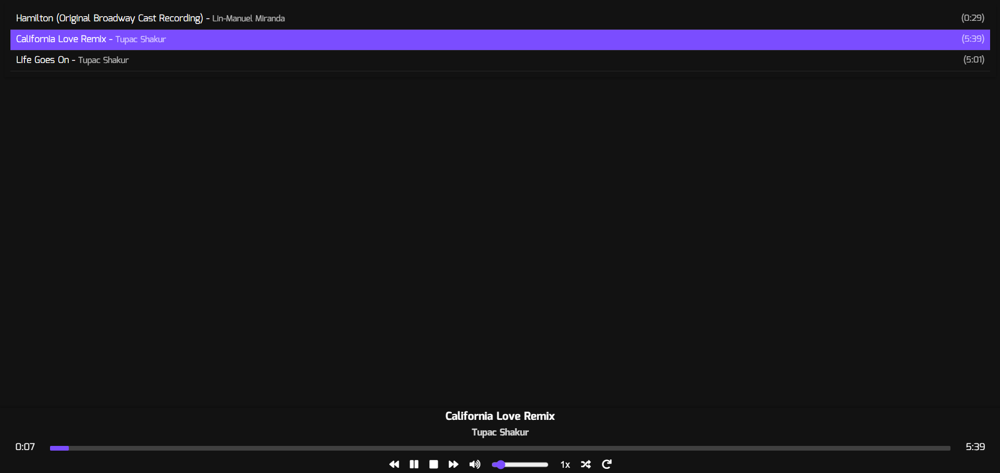
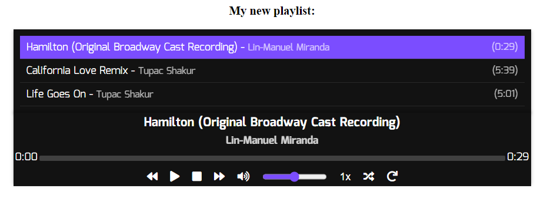

# WebPlayerJS: A Simple and Flexible Audio Player for Web🎵

Welcome to WebPlayerJS, your go-to solution for integrating an audio player into your web projects.
Crafted with TypeScript/JavaScript, WebPlayerJS offers an easy-to-use, customizable, and keyboard-navigable audio player experience. 🚀

## ✨ Features

WebPlayerJS stands out with its:

-   **Simplicity**: Easy integration into any web project.
-   **Customizability**: Style it as per your website’s theme.
-   **Keyboard Navigation**: Enhanced accessibility with keyboard controls.
-   **Sticky Mode**: Keep your music accessible as users scroll.
-   **Queue Management**: Easy handling of song queues.

## 🖼️ Screenshots

Explore the flexibility of WebPlayerJS with these screenshots:

-   **Full-Width Player**  
    
-   **Contained Player**  
    

## 📦 Installation

Include WebPlayerJS in your project by adding the main script and stylesheet:

```
<link rel="stylesheet" href="dist/css/style.css" />
<script src="dist/js/main.js"></script>
```

## 🚀 Usage

Creating a new instance of WebPlayerJS is straightforward, Just define a container in your HTML and initialize the player with your settings:

```
<div id="playerContainer"></div>

<script> const player = new MusicPlayer("playerContainer", {
        songs: [/* array of your songs */],
        // other settings (optional)
    }); </script>
```

## 📚 API and Functions

Here's a comprehensive list of functions you can use with WebPlayerJS:

<table>
    <thead>
        <tr>
            <th>Function</th>
            <th>Description</th>
        </tr>
    </thead>
    <tbody>
        <tr>
            <td><code>play()</code></td>
            <td>Starts playback of the current song.</td>
        </tr>
        <tr>
            <td><code>pause()</code></td>
            <td>Pauses the current song.</td>
        </tr>
        <tr>
            <td><code>stop()</code></td>
            <td>Stops the current song and resets its position.</td>
        </tr>
        <tr>
            <td><code>nextSong()</code></td>
            <td>Advances to the next song in the queue.</td>
        </tr>
        <tr>
            <td><code>previousSong()</code></td>
            <td>Goes back to the previous song in the queue.</td>
        </tr>
        <tr>
            <td><code>setSong(songId)</code></td>
            <td>Sets the current song by its ID.</td>
        </tr>
        <tr>
            <td><code>togglePlayPause()</code></td>
            <td>Toggles between playing and pausing the song.</td>
        </tr>
        <tr>
            <td><code>toggleMute()</code></td>
            <td>Toggles the mute state of the player.</td>
        </tr>
        <tr>
            <td><code>toggleShuffle()</code></td>
            <td>Toggles shuffle mode for the song queue.</td>
        </tr>
        <tr>
            <td><code>toggleRepeat()</code></td>
            <td>Toggles repeat mode for the current song.</td>
        </tr>
        <tr>
            <td><code>setVolume()</code></td>
            <td>Sets the volume (use the volume element's value).</td>
        </tr>
        <tr>
            <td><code>changeVolume()</code></td>
            <td>Changes the volume by a specified amount.</td>
        </tr>
        <tr>
            <td><code>addTime(seconds)</code></td>
            <td>Adds a specified number of seconds to the song position.</td>
        </tr>
        <tr>
            <td><code>jumpToTime(seconds)</code></td>
            <td>Jumps to a specific time in the current song.</td>
        </tr>
    </tbody>
</table>

## 🎨 Customization

Adjust the appearance and functionality according to your needs with `settings`:

-   Use CSS to style the player.
-   Enable keyboard controls for enhanced accessibility.
-   Activate the sticky mode for a persistent music experience.

## 🌟 Example HTML

See `index.html` and `example_small.html` in the repository for comprehensive usage examples.

## 🚀 Get Started

Ready to elevate your web project with seamless audio integration? Clone the repository, check out the examples, and start using WebPlayerJS =]

---

Happy coding and enjoy the music with WebPlayerJS! 🎶🚀
